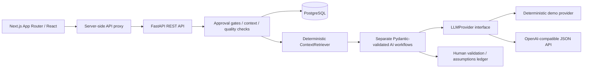
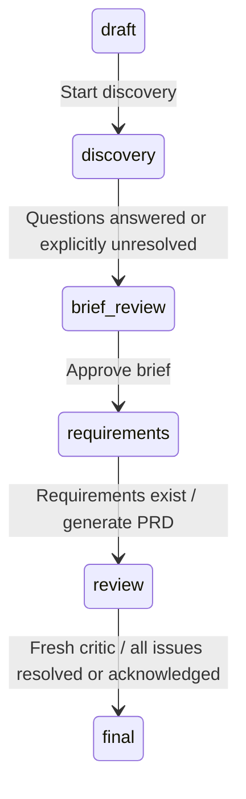

# Context — AI Product Context & PRD Copilot

A minimal organization-aware product workspace built with Next.js, React, TypeScript, Tailwind, FastAPI, Pydantic, SQLAlchemy, and PostgreSQL. It establishes company knowledge first, then guides initiatives through discovery, an approved brief, structured requirements, an assumptions ledger, and independent review.

The fictional FinEdge workspace and two products are seeded automatically. Open **Home Loan Readiness Score** to start the example discovery. The complete workflow runs without an API key.

For a walkthrough of the project, request lifecycle, and interview questions, read [the interview guide](docs/INTERVIEW_GUIDE.md). For your first GitHub push, the CI/CD pipeline, and release images, read [GitHub setup](docs/GITHUB_SETUP.md).

The UI has three main views: PRDs, Context, and Products. Each PRD opens a single-column workflow with on-demand Assumptions, Preview, and Quality views.

## Architecture



```text
backend/app/
  db.py             Settings, engine, sessions, timestamps
  models.py         Relational domain records
  schemas.py        Strict input and AI-output contracts
  deps.py           Demo identity boundary and state guards
  context.py        Context retrieval and maturity scoring
  llm.py            Provider interface, mock, compatible HTTP provider
  workflows.py      Separate workflow services and system prompts
  quality.py        Deterministic review checks and score
  organizations.py  Context, documents, rules, products, onboarding APIs
  prds.py           Discovery through finalization and export
  seed.py           Fictional demo data
  main.py           Application lifecycle and error handling
backend/tests/      Isolated API and domain tests
frontend/src/
  app/              App Router entry, layout, theme
  components/       Workspace, knowledge, onboarding, products, editors
  lib/              Typed API client and domain types
```

## Quick start: PostgreSQL + Docker

Install Docker with Compose, then from the repository root:

```sh
cp .env.example .env
docker compose up --build
```

PowerShell users can use `Copy-Item .env.example .env`.

- App: http://localhost:3000
- API / interactive OpenAPI documentation: http://localhost:8000/docs
- Health: http://localhost:8000/health
- PostgreSQL: localhost:5432, database/user/password `copilot` (local demo only).

Compose waits for PostgreSQL before starting the API. On first startup SQLAlchemy creates the baseline schema and seeds the demo. The named `postgres_data` volume survives container restarts. `docker compose down` stops the app without removing that volume.

## Local development

Prerequisites: Python 3.12+, Node.js 22+, npm, and PostgreSQL 16 for the primary database path.

From the repository root:

```sh
python -m venv .venv
# Windows: .venv\Scripts\activate
source .venv/bin/activate
pip install -r backend/requirements-dev.txt
docker compose up -d db
cp .env.example backend/.env
cd backend
uvicorn app.main:app --reload --host 127.0.0.1 --port 8000 --no-access-log
```

In another terminal:

```sh
cd frontend
npm ci
npm run dev
```

The frontend proxies `/api/*` to `http://127.0.0.1:8000`. Browser code never receives provider credentials. For a different backend address, set `API_URL` before starting/building Next.js.

For a lightweight local demo without PostgreSQL, set `DATABASE_URL=sqlite:///./copilot.db` in `backend/.env`. With no `.env`, this is the default. SQLite is a development convenience; Compose always uses PostgreSQL. Local preview data lives in `backend/copilot.db` and persists across restarts.

## Environment variables

- `DATABASE_URL`: SQLAlchemy PostgreSQL URL (`postgresql+psycopg://...`) or local SQLite URL.
- `LLM_PROVIDER`: `mock` (default) or `compatible`.
- `LLM_API_KEY`: server-side API key. If missing, deterministic mock mode is selected.
- `LLM_MODEL`: provider model identifier.
- `LLM_BASE_URL`: OpenAI-compatible API base ending in `/v1`.
- `SEED_DEMO`: `true` by default; `false` creates only the demo identity.
- `CORS_ORIGINS`: comma-separated allowed browser origins, default `http://localhost:3000`.
- `API_URL`: Next.js server proxy target; defaults to the local API.

Python reads `.env` relative to its working directory. Compose reads the root `.env`. Do not commit either file or put secrets in `NEXT_PUBLIC_*` variables.

## Core workflows

### Establish organization knowledge

1. **Established organization:** enter structured company information or proceed to import existing documentation/PRDs. Text, Markdown, and text-based PDFs are supported (5 MB, 100 pages, 100,000 extracted characters maximum).
2. **Existing product, limited documentation:** guided questions cover users, buyers, current journey, business model, metrics, architecture, regulation, rules, and principles.
3. **Starting from an idea:** twelve discovery stages develop a company blueprint. “Help me define it” saves proposals as assumptions; “Not decided yet” preserves unknowns.

Review the blueprint, confirm at least one fact, and explicitly validate it before creating products or PRDs. Imported AI extractions are never automatically confirmed. Context is organized into twelve categories with source, status, confidence, and timestamps. The maturity score awards one point per confirmed category and half per assumed category across eleven knowledge categories; open questions do not inflate maturity.

### Create a PRD

1. Select a product, describe the initiative, and flag whether it includes AI/ML.
2. Inspect the exact context that will be supplied. The backend stores the selected context snapshot with the PRD.
3. Start discovery. Three to seven questions include explanations and applicable rules.
4. Answer questions or explicitly mark them unknown/skipped.
5. Generate and edit the brief, then approve it.
6. Generate structured requirements or add/edit them individually.
7. Review assumptions. Confirmed assumptions can be explicitly promoted into organization knowledge for future PRDs.
8. Assemble the PRD and run the independent critic.
9. Apply suggested fixes, edit affected records, or acknowledge non-critical issues. Edits invalidate review; rerun the critic.
10. Finalize after a fresh review with no open issues. Export as Markdown.

State transitions are enforced by the API:



Finalized PRDs are immutable in the MVP. The preview derives requirements and assumptions from their records, so those remain authoritative rather than a stale document blob.

## AI implementation

`LLMProvider.generate(workflow, prompt, payload, schema)` returns a validated Pydantic model. Organization extraction, discovery, discovery help, brief generation, requirements, PRD composition, and critic each use a separate service and instruction. Business logic does not parse free-form text from the model.

The `compatible` provider supports JSON-mode chat-completion APIs. Every output is validated before persistence; invalid responses or network errors return a recoverable error and roll back the request transaction. Providers must support `/chat/completions` and `response_format: {type: "json_object"}`. To add a non-compatible provider, implement the protocol and add it to the factory without changing workflow services.

Mock mode is deterministic and visibly labeled. It uses the selected product, initiative, answers, and rules. Its generated requirements and rollout are **proposals**, not validated product specifications. It does not perform semantic document extraction or deep semantic critique; extraction preserves input statements as assumed candidates. Deterministic checks still run in every mode. No provider key is needed for demos or tests.

Retrieval selects relevant categories and keyword matches, prioritizes confirmed context, includes all structured rules, excludes rejected items, and limits ordinary context to 18 items plus 12 product context items. Product data and selected context are visible in the context inspector. The retriever protocol can later accept semantic search without introducing a vector database now.

## Quality and rules

Quality is an arithmetic mean of deterministic checks: problem, user, scope, acceptance-criteria coverage, measurable metrics, edge-case coverage, risk presence, unresolved assumptions, rule issues, and AI fallback when relevant. The score is a completeness signal, not a claim of correctness. Measurability uses a simple numerical-target/unit heuristic.

The critic combines deterministic findings with a separate LLM review. Built-in rule checks cover approval guarantees, analytics requirements, and explainability. Other prose rules require explicit human attestation in mock mode; live review evaluates them semantically. Critical issues cannot be ignored. Non-critical acknowledgements remain recorded and visible.

## API

See `/docs` for the current, generated request contracts. Main resources:

- `/organizations`, `/organizations/{id}`, `/organizations/{id}/validate`
- `/organizations/{id}/context`, `/organizations/{id}/rules`
- `/organizations/{id}/import`, `/organizations/{id}/documents`, `/organizations/{id}/help`
- `/products`, `/products/{id}`, `/products/{id}/context`
- `/prds`, `/prds/{id}`, `/prds/{id}/discovery`
- `/prds/{id}/brief`, `/prds/{id}/brief/approve`
- `/prds/{id}/requirements`, `/prds/{id}/requirements/manual`
- `/prds/{id}/assumptions/{assumption_id}`, `/prds/{id}/assumptions/{assumption_id}/promote`
- `/prds/{id}/generate`, `/prds/{id}/review`, `/prds/{id}/finalize`, `/prds/{id}/export`

All PRD detail responses include the questions, brief, requirements, assumptions, review findings, and quality breakdown. This keeps the workflow, assumptions, preview, and quality views synchronized after each mutation.

## Verification

```sh
cd backend
python -m pytest -q
cd ../frontend
npm run typecheck
npm run lint
npm run build
```

Backend tests default to isolated in-memory SQLite with foreign keys enabled and the mock provider. With `TEST_DATABASE_URL`, they run in temporary PostgreSQL schemas; GitHub Actions runs both database modes. They test context CRUD and isolation, blueprint gating, import status, assumptions, promotion idempotency, illegal PRD transitions, unknown preservation, requirement creation, review invalidation, retrieval, rule evaluation, scoring, and the full workflow through finalization and export. GitHub Actions also builds the Compose stack and runs `scripts/smoke.py` through its frontend proxy before allowing container publication.

## CI/CD

The GitHub Actions workflow in `.github/workflows/pipeline.yml` runs backend tests (SQLite and PostgreSQL), frontend lint/type/build checks, and a container smoke test. Successful default-branch pushes and version tags publish backend/frontend images to GitHub Container Registry. Manual runs default to checks only, with optional publishing on the default branch. Hosting deployment is intentionally separate.

No repository-specific workflow edits or LLM credentials are needed. See [GitHub setup](docs/GITHUB_SETUP.md) for the trigger rules, image names, local commands, and the steps you will perform to commit and push.

## Screenshot placeholders

- `docs/screenshots/prds.png`: the minimal PRD list and workspace navigation.
- `docs/screenshots/blueprint.png`: confirmed facts, assumptions, open questions.
- `docs/screenshots/prd-workspace.png`: the focused workflow and optional preview view.
- `docs/screenshots/review.png`: critic findings and deterministic score.

These are documentation placeholders; image files are not included.

## MVP boundaries and roadmap

- **Demo identity:** the identity/ownership boundary is isolated in `deps.py`. All visitors currently share one demo identity. Add real authentication, authorization, CSRF strategy, rate limits, and tenancy before exposing sensitive organizational data on a public deployment.
- **Schema evolution:** startup creates the initial schema. Add Alembic migrations before changing a deployed database; `create_all` does not migrate existing tables.
- **Review semantics:** deterministic matching is conservative and incomplete. Expand rule evaluators and add provider evaluation datasets before treating the critic as a policy gate.
- **Documents:** extraction supports text PDFs, not scanned OCR, tables, images, citations to page coordinates, or asynchronous large-file processing.
- **Workflow:** onboarding answers are persisted as context, but the current interview position is held in the page. Resume incomplete blueprints through Organization Context. Finalized PRDs have no revision/fork workflow yet.
- **Deployment:** the deliverable is the requested Next.js/FastAPI/PostgreSQL application with Compose. The Sites Worker runtime cannot directly host its Python/PostgreSQL backend. It is not deployed to an external service.
- **Future:** versioned context and decisions, richer retrieval, document provenance, calibrated AI evaluations, schema migrations, authenticated workspace membership, background generation, and PRD revisions. Billing, enterprise SSO, Jira/Slack/Figma integrations, realtime collaboration, and vector infrastructure are intentionally excluded.
